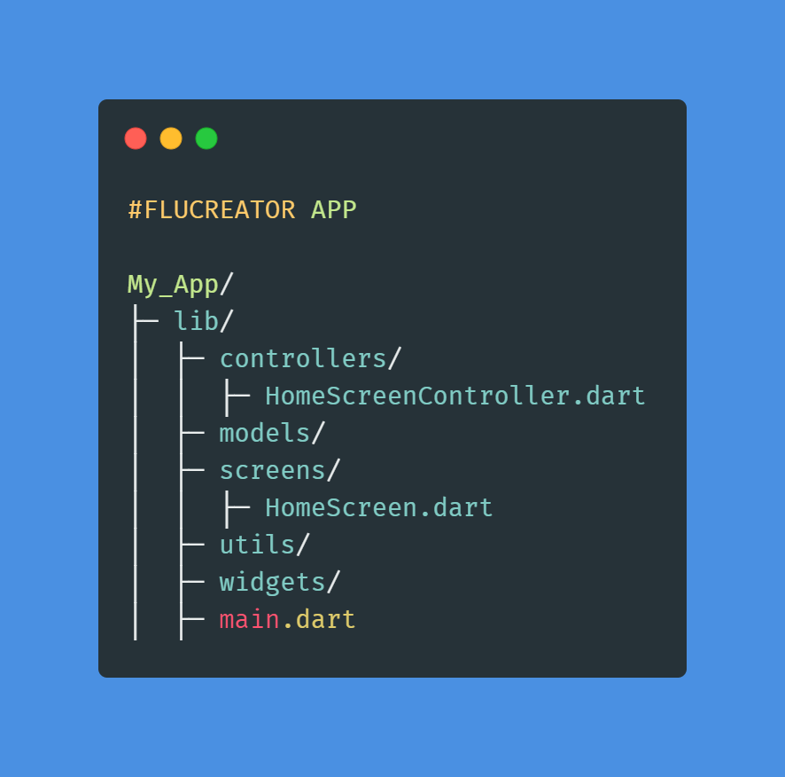
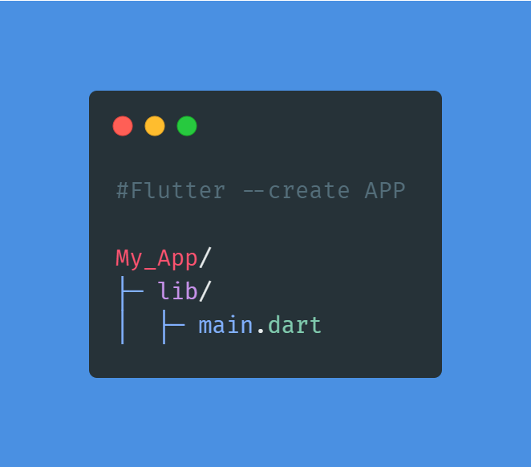
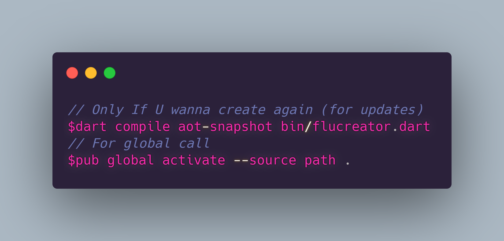

## Flucreator

    You can use Flucreator to create a new Flutter project.
    Automatically create a new Flutter project with Getx & Directories. 

#### Normal Usage
```
// You Can Activate Flucreator With This Command Line 
pub global activate --source git https://github.com/Abdusin/Flucreator.git
// You can run like this
fluecretor --org com.abdusin myapp
// Also you can run with command too 
// If run without arguments console will ask details
flucreator
```

`$flucreator`             |  `$flutter --create`
:-------------------------:|:-------------------------:
  |  

#### Advance
```
// Only If U wanna create again (for updates)
dart compile aot-snapshot bin/flucreator.dart
// You need to run this for global calling
pub global activate --source path .
```


# Path
 * Controllers
    * HomeScreenController.dart
 * Models
 * Screens
    * HomeScreen.dart
 * Utils
    * AppSpaces.dart
 * Widgets
 * main.dart
